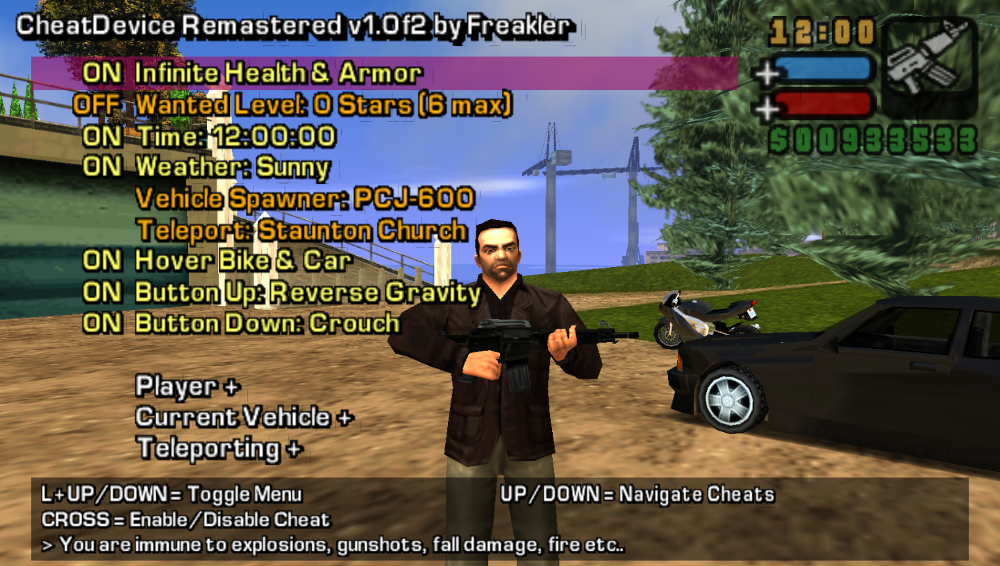

<a name="readme-top"></a>
<br />
for Grand Theft Auto Liberty &amp; Vice City Stories for PlayStation Portable


<br />

## About The Project
After over 15 years since the original CheatDevice release, with this remastered version (remake actually), I recreated the whole project from ground up whenever I had some freetime. It is one plugin for both Stories games now and compatible with almost all versions!

Once in-game, just like with the original, the menu can be opened and closed by pressing ***L + UP***. And when saving your cheat preferences from the menu a config file will be created which automatically reloads everything the next time you start the game. But there really is so much more so why don't you go take a look yourself...

Happy Cheating! :)


## Installation
Move `cheatdevice_remastered` folder to `ms0:/PSP/PLUGINS/` *(create directories if needed)*.

### PSP / Vita (extra steps)

> [!IMPORTANT]
>  Enable 333Mhz / Overclock mode in game for a smoother experience.
>
> (For Vita users) If you are using the [native resolution patch by TheFloW](https://github.com/TheOfficialFloW/GTANativeRes) make sure to load CheatDevice first!

#### Using *PRO*, *(L)ME 2.3* or *Adrenaline*

For these CFWs, it's recommended you use **CDR Loader**. (_[Why?](loader/README.md#why)_)


 - Append the following line to `ms0:/seplugins/GAME.TXT`
```
ms0:PSP/PLUGINS/cheatdevice_remastered/cdr_compat_loader.prx 1
```

 - Enable extra RAM in Recovery Menu (aka. `Force High Memory Layout`) in *(L)ME 2.3* and *Adrenaline*. This option is broken with *PRO*.

#### Using ARK
> [!IMPORTANT]
> If you're on a **PSP-1000** ("Fat"), due to hardware constraints, you'll have to use the Lite version of CheatDevice Remastered. Replace `cheatdevice_remastered.prx` with `cheatdevice_remastered_lite.prx`.

 - Append the following line to your `PLUGINS.TXT`
```
ULUS10041 ULES00182 ULES00151 ULUS10160 ULES00502 ULES00503 ULUS01826 ULUS11826 ULUX80146 ULET00417, ms0:PSP/PLUGINS/cheatdevice_remastered/cheatdevice_remastered.prx, on
```

## Compatibility
All versions of the game (except the Japanese releases) are supported! As a bonus the German versions will be patched back uncut again. Tested and working on selected PSP CFWs as well as on *[Adrenaline eCFW](https://github.com/TheOfficialFloW/Adrenaline/releases)* for Vita and *[PPSSPP](https://www.ppsspp.org/)* v1.11+
 
This plugin wasn't made AND won't work for the LCS mobile versions.


## UserScripts
You can create basic UserScripts saved in plain text which currently is the next best thing to the original UserCheats. Everything from simply changing the weather to creating whole new missions is possible!

You can find them ***[here](https://github.com/Freakler/CheatDeviceRemastered-UserScripts)***, you can also learn how to make one ***[here](https://github.com/Freakler/CheatDeviceRemastered-UserScripts/wiki/UserScript-Tutorial---Part-1,-Getting-Started)***.


## Changelog
<details><summary><b>v1.0h3</b> <i>(27th Mar. 2026)</i></summary><ul>
<li>added Empire Editor (VCS) (thx <b><a href="https://github.com/NABN00B">@NABN00B</a></b>)
<li>added <code>ULUS11826</code> (<i>Seen in Liberty City</i> Mod) to <code>plugin.ini</code>
<li>added Spanish translation (thx <b><a href="https://github.com/vdarg">@vdarg</a></b> / <b>exvaae</b>)
<li>added an optional loader prx for older CFWs (via <b><a href="https://github.com/danssmnt">@danssmnt</a></b>)
<li>fixed UserScript Menu lag for PPSSPP on devices with slow storage (via <b><a href="https://github.com/danssmnt">@danssmnt</a></b>)
<li>code improvements, optimizations and LOTS of fixes (via <b><a href="https://github.com/danssmnt">@danssmnt</a></b>)
<li>compatibility with newer SDK (via <b><a href="https://github.com/danssmnt">@danssmnt</a></b> &amp; thx to <b><a href="https://github.com/Parik27">@Parik27</a></b>)
</ul></details>

<details><summary><b>v1.0h2</b> <i>(6th Jan. 2025)</i></summary><ul>
<li>made <code>TOPFUN</code> spawnable in VCS (thx <b><a href="https://github.com/Parik27">@Parik</a></b>)
<li>fixed GXT-less Vehicles names in Garage Editor
<li>added a warning message when running low on memory
<li>fixed config saving on real hardware
<li>fixed config corruption when "Exit Game"
<li>fixed Heli-height issue with ARK-4 with "Extra memory" enabled
<li>fixed Lite version crashing on PPSSPP for VCS
<li>more minor fixes &amp; adjustments
</ul></details>

<details><summary><b>v1.0h "The Translation Release"</b> <i>(15th Sep. 2024)</i></summary><ul>
<li>added minigun to pickup spawner and mark on map cheat for VCS
<li>fixed <code>if and</code> / <code>if or</code> conditions for user scripts (thx <b><a href="https://github.com/Parik27">@Parik</a></b>)
<li>fixed vehicle spawner blacklist in VCS (thx <b><a href="https://github.com/NABN00B">@NABN00B</a></b>)
<li>vehicles created with vehicle spawner now disappear when not close (thx <b><a href="https://github.com/NABN00B">@NABN00B</a></b>)
<li>added option to switch back to "real" speedometer speed calculation
<li>added PED Clothes Colors to Pedestrian Editor
<li>enabled Handling &amp; ModelFlags in Handling Editor (thx <b><a href="https://github.com/NABN00B">@NABN00B</a></b>)
<li>doubled the maximum user script size &amp; custom strings to 32
<li>fixed a problem with heli-height-patch in combination with PPSSPP (thx <b><a href="https://github.com/Parik27">@Parik</a></b>)
<li>added experimental Swimming Cheat for LCS
<li>added Option to swap X with R for special cheats (for gta_remastered's swapped controls)
<li>added unlimited swimming cheat for VCS (by <b><a href="https://github.com/danssmnt">@danssmnt</a></b>)
<li>the whole menu can now be translated!! (by <b><a href="https://github.com/danssmnt">@danssmnt</a></b>)
<li>more optimizations and fixes
</ul></details>

<details><summary><b>v1.0g2</b> <i>(3rd Mar. 2024)</i></summary><ul>
<li>better hover vehicle controls 
<li>added VCS garage fix 
<li>speedometer fix (more realistic but probably still not accurate)
<li>rocket boost fix (1 was the same as off)
<li>cheat description strings adjusted
<li>added Sindacco Chronicles Hidden package object to pickups
<li>now skipping special vehicles in vehicle spawner
<li>removed crashing skin <code>FRANFOR</code> (LCS)
<li>fixed userscript opcode <code>0482</code> (VCS)
<li>added "the dummy" skin (LCS)
<li>added fix for Sindacco Chronicles' custom radio color showing in menu
<li>added unlimited height limit for helis and planes (VCS)
<li>fixed and enhanced power-jump 
<li>added lock/unlock car to up/down button cheat
<li>fixed PPSSPP blackscreen for LCS
<li>more optimizations and fixes
</ul></details>

<details><summary><b>v1.0g "The Open Source Release"</b> <i>(4th May 2023)</i></summary><ul>
<li>fixed newline bug in UserScripts
<li>better "high memory layout" detection
<li>added Cheat "Untouchable"
<li>added Cheat "Freeze Traffic"
<li>added Cheat "Cars drive on water"
<li>added Cheat "Mission Selector"
<li>added Action-buttons Cheat "Impulse"
<li>added Action-buttons Cheat "Jump with Vehicle"
<li>added "unfreeze" option for ped/vehicle to touch cheats
<li>added option to adjust player model of stock cheat for LCS
<li>added option to display free main memory 
<li>fixed bug in loading last touched ped/vehicle/object position
<li>added Timecycle Editor (thanks to <b><a href="https://github.com/DenielX">@DenielX</a></b>)
<li>removed the "bigger legend box" option
<li>removed the "disable advanced UI" option
<li>removed the "show Ped's stats when aimed at" cheat
<li>removed min and max bounds for editors
<li>you can now use R + UP/DOWN to fast scroll through categories
<li>even more bug fixes and code cleaning for open-sourcing
</ul></details>

<details><summary><b>v1.0f "The late Anniversary Release"</b> <i>(29th Dez. 2022)</i></summary><ul>
<li>added lite version of plugin without advanced features for casual cheaters
<li>moved <code>CDR/</code> folder from root to <code>PSP/PLUGINS/cheatdevice_remastered/</code>
<li>config <code>.cfg</code> and names <code>.ini</code> are no longer dynamically created next to the plugin
<li>added teleport to Highest Solid Ground for VCS
<li>added teleport to Stadium Stage for VCS
<li>added teleport to Mendez's Mansion Interior for VCS
<li>fixed a bug loading first teleport location from config
<li>UserScripts can now have 16 custom strings with a max length of 256
<li>fixed UserScript bugs due to custom strings and added more error messages
<li>added fix for crouching and manual aiming at the same time
<li>added Cheat to adjust the BMX Jump Height (thanks to <b>darkdraggy</b>)
<li>added Cheat to warp out of water with car automatically for LCS
<li>fixed bug where warping out of water results in endless loop if water below
<li>added some more Stock cheats
<li>realtime clock cheat now sets system time continuously
<li>more bug fixes and code cleaning for opensourceing
<li>more &amp; updated UserScripts 
</ul></details>

<details><summary><b>v1.0e3</b> <i>(25th Jun. 2022)</i></summary><ul>
<li>fixed a bug in UserScript translation (<code>if and</code> / <code>if or</code>)
<li>vehicle spawner now makes sure vehicle doors are not locked
<li>blocked more crashing cheats in multiplayer 
</ul></details>

<details><summary><b>v1.0e2</b> <i>(24th Jun. 2022)</i></summary><ul>
<li>editor's slot/no position is now saved to config as well
<li>added possibility to use custom text in scripts
<li>added folder support to UserScripts
<li>more &amp; updated UserScripts 
</ul></details>

<details><summary><b>v1.0e "The Config Update"</b> <i>(29th Apr. 2022)</i></summary><ul>
<li>added button to auto-select current weapon in Weapon.dat Editor
<li>config rework, removed .ini in favor of faster binary file
<li>added option to enable autosaving to config
<li>added the classic Gather Spell cheat
<li>added the classic Rocket Boost cheat
<li>added "Reverse Gravity" to button up/down cheat shortcuts
<li>added "Toggle GatherSpell" to button up/down cheat shortcuts
<li>added "Toggle Slowmo" to button up/down cheat shortcuts
<li>deactivated user scripts menu in multiplayer
<li>more UserScripts 
</ul></details>

<details><summary><b>v1.0d "The UserScripts Update"</b> <i>(20th Mar. 2022)</i></summary><ul>
<li>fixed Infinite Ammo for VCS (Grenade &amp; Camera Slots)
<li>fixed unload vehicle teleport bug in VCS
<li>added UserScripts
<li>added <code>Weapon.dat</code> Editor
<li>added missing info to Particle and Handling Editors for VCS
<li>added facing direction in degree to draw coordinates
<li>internal Script usage wont overwrite mission scripts anymore
<li>removed LCS Building / Interior switching because of UserScripts 
</ul></details>

<details><summary><b>v1.0c2</b> <i>(5th Jan. 2022)</i></summary><ul>
<li>fixed crash when trying to aim-melee a PED in VCS on PSP/Vita
<li>fixed crash for "Behave like Tank" cheat with Bikes on PSP/Vita
<li>added VCN Maverick spawn on VCN landing pad 
</ul></details>

<details><summary><b>v1.0c "The Content Update"</b> <i>(27th Dec. 2021)</i></summary><ul>
<li>fixed crash on Loadscreen after resume from sleepmode in LCS
<li>fixed menu text in LCS not returning to fullscreen after sleepmode
<li>fixed rare crashes with random loadscreens
<li>fixed wrong RadioStation-name detection in Editors
<li>added IDE type-dynamic Editors with basic info
<li>adjusted Speed'O'meter position for Mulitplayer
<li>added <code>OnMission</code> bool fake cheat
<li>added Staunton Bridge Lift control cheat
<li>added Delorean detection like in original LCS CheatDevice
<li>added Building / Interior switching (LCS only for now)
<li>added Walking Speed Multiplier cheats for Player &amp; Pedestrians 
</ul></details>

<details><summary><b>v1.0b3</b> <i>(15th Nov. 2021)</i></summary><ul>
<li>added Vehicle behaves like Tank cheat
<li>added experimental Powerjump cheat
<li>reworked vehicle spawner
<li>bugfixes 
</ul></details>

<details><summary><b>v1.0b2</b> <i>(8th Nov. 2021)</i></summary><ul>
<li>fixed crash on PPSSPP when pressing R-Trigger 
</ul></details>

<details><summary><b>v1.0b "The PPSSPP Update"</b> <i>(7th Nov. 2021)</i></summary><ul>
<li>added support for use with PPSSPP
<li>added color-box for ped/vehicle-colors editor
<li>adjusted World-Gravity value bounds and config
<li>added N.O.S. boost cheat for vehicles
<li>changed fast scrolling in Editors (now hold R-Trigger + LEFT / RIGHT)
<li>increased height limit for helicopters in LCS (thanks to darkdraggy) 
</ul></details>

<details><summary><b>v1.0 "The Initial Release"</b> <i>(24th Oct. 2021)</i></summary><ul>
<li>typo &amp; design stuff
</ul></details>

<details><summary><b>v0.1c</b></summary><ul>
<li>fixed Pickup Spawner not working for VCS
</ul></details>

<details><summary><b>v0.1b "Preview"</b> <i>(2nd Oct. 2021)</i></summary><ul>
<li>added lock vehicle doors when inside
<li>added ped model swapping
<li>added crouching
<li>added better Scrollbar behaviour
<li>added side mission timer freeze
<li>added debug loadscreen messages 
</ul></details>


## See also
- Right analog stick control *(for [PPSSPP](https://github.com/Freakler/ppsspp-GTARemastered), for [Adrenaline](https://github.com/TheOfficialFloW/RemasteredControls/releases/tag/GTARemastered))*
- Native Resolution Patch *(for [Adrenaline](https://github.com/TheOfficialFloW/GTANativeRes))*


## Thanks &amp; Greetings
*Edison Carter, vettefan88, Waterbottle, Jeremie Blanc, ADePSP, Joek2100, PSPHacker108, Sousanator, Rasal, Mister Enchilada, Skiller, theY4Kman, Noru, KING_REY-S, thehambone, the NSA, gtaforums.com, gtamods.com, gtamodding.ru, TheFlow, aap, Firehead, Silent, neur0n, Samilop "Cimmerian" Iter, darkdraggy, hrydgard, unknownbrackets, Micsuit / danssmnt, NielsB, metehan989, DenielX, Acid_Snake, NABN00B*

People on the [CheatDeviceRemastered Discord Server](https://discord.gg/7DERFmkgYq) and everyone else contributing and supporting!

<p align="right"><a href="#readme-top">Back to the top</a></p>
